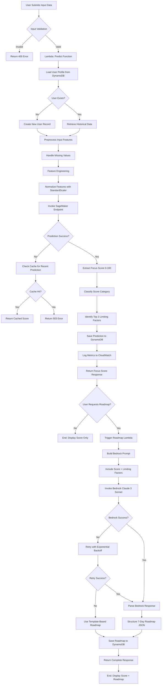

# Deep-Work Potential Predictor - Design Specification

## Architecture Overview

The Deep-Work Potential Predictor uses a serverless AWS architecture to provide scalable, cost-effective predictions and roadmap generation. The system leverages AWS Lambda for compute, DynamoDB for data persistence, SageMaker for ML inference, and Bedrock for AI-powered roadmap generation.

## System Architecture

### High-Level Components

1. **API Gateway**: RESTful API entry point for all client requests
2. **Lambda Functions**: Serverless compute for business logic
3. **DynamoDB**: NoSQL database for user data and prediction history
4. **SageMaker Endpoint**: Hosted Multiple Linear Regression model for focus score prediction
5. **Amazon Bedrock**: Claude 3 Sonnet for personalized roadmap generation
6. **S3**: Storage for model artifacts, training data, and static assets
7. **CloudWatch**: Logging, monitoring, and alerting

### Architecture Diagram

```
┌─────────────┐
│   Client    │
│ (Web/Mobile)│
└──────┬──────┘
       │
       ▼
┌─────────────────────────────────────────────────────────────┐
│                      API Gateway                             │
│  /predict  │  /roadmap  │  /history  │  /feedback           │
└──────┬──────────┬───────────┬─────────────┬─────────────────┘
       │          │           │             │
       ▼          ▼           ▼             ▼
┌──────────┐ ┌──────────┐ ┌──────────┐ ┌──────────┐
│ Lambda   │ │ Lambda   │ │ Lambda   │ │ Lambda   │
│ Predict  │ │ Roadmap  │ │ History  │ │ Feedback │
└────┬─────┘ └────┬─────┘ └────┬─────┘ └────┬─────┘
     │            │            │             │
     ▼            │            ▼             ▼
┌──────────┐      │      ┌─────────────────────┐
│SageMaker │      │      │     DynamoDB        │
│Endpoint  │      │      │  ┌───────────────┐  │
│(Linear   │      │      │  │ Users Table   │  │
│Regressor)│      │      │  ├───────────────┤  │
└────┬─────┘      │      │  │Predictions    │  │
     │            │      │  │    Table      │  │
     │            ▼      │  └───────────────┘  │
     │      ┌──────────┐ └─────────────────────┘
     │      │ Bedrock  │
     │      │ Claude 3 │
     │      │  Sonnet  │
     │      └──────────┘
     │
     ▼
┌─────────────────────────────────────────────────────────────┐
│                        CloudWatch                            │
│              Logs │ Metrics │ Alarms                         │
└─────────────────────────────────────────────────────────────┘
```

## Data Flow: User Input to Focus Score



## Component Design

### 1. Lambda Functions

#### Predict Function
**Purpose**: Process user input and generate focus score prediction

**Input**:
```json
{
  "user_id": "string",
  "timestamp": "ISO8601",
  "features": {
    "sleep_hours": 7.5,
    "exercise_minutes": 30,
    "caffeine_intake": 2,
    "time_of_day": "morning",
    "noise_level": "low",
    "meeting_count": 1,
    "stress_level": 3
  }
}
```

**Output**:
```json
{
  "prediction_id": "uuid",
  "focus_score": 78,
  "category": "High",
  "limiting_factors": [
    "stress_level",
    "meeting_count",
    "sleep_hours"
  ],
  "confidence": 0.85,
  "timestamp": "ISO8601"
}
```

**Processing Steps**:
1. Validate input schema
2. Retrieve user profile from DynamoDB
3. Apply feature preprocessing (imputation, normalization)
4. Invoke SageMaker endpoint with processed features
5. Parse prediction and classify into category
6. Identify limiting factors using feature importance
7. Store prediction in DynamoDB
8. Return structured response

**Error Handling**:
- Input validation errors → 400 Bad Request
- SageMaker timeout → Return cached prediction or 503
- DynamoDB errors → Log and retry with exponential backoff

#### Roadmap Function
**Purpose**: Generate personalized productivity roadmap using Bedrock

**Input**:
```json
{
  "user_id": "string",
  "prediction_id": "string",
  "focus_score": 78,
  "limiting_factors": ["stress_level", "meeting_count"],
  "user_context": {
    "persona": "developer",
    "goals": ["increase deep work hours"],
    "constraints": ["remote work", "multiple time zones"]
  }
}
```

**Output**:
```json
{
  "roadmap_id": "uuid",
  "roadmap": {
    "day_1": {
      "date": "2026-02-16",
      "focus_blocks": ["9:00-11:00 AM", "2:00-4:00 PM"],
      "actions": [
        "Practice 5-minute meditation before work",
        "Block calendar for deep work sessions"
      ],
      "milestone": "Complete 2 hours of uninterrupted work"
    }
  },
  "weekly_goal": "Increase focus score to 85+",
  "generated_at": "ISO8601"
}
```

**Bedrock Prompt Template**:
```python
prompt = f"""You are an expert productivity coach analyzing deep work patterns.

User Profile:
- Persona: {persona}
- Current Focus Score: {focus_score}/100 ({category})
- Key Limiting Factors: {', '.join(limiting_factors)}
- Goals: {goals}
- Constraints: {constraints}

Task: Generate a practical 7-day roadmap to improve deep work capacity.

Requirements:
1. Provide 2-3 specific focus time blocks per day
2. Include actionable habit changes addressing the limiting factors
3. Suggest environmental optimizations
4. Set realistic daily milestones
5. Define a measurable weekly goal

Format your response as valid JSON matching this structure:
{{
  "roadmap": {{
    "day_1": {{
      "date": "YYYY-MM-DD",
      "focus_blocks": ["HH:MM-HH:MM AM/PM"],
      "actions": ["specific action"],
      "milestone": "measurable outcome"
    }}
  }},
  "weekly_goal": "specific improvement target"
}}

Be specific, actionable, and encouraging."""
```

**Bedrock Configuration**:
```python
bedrock_params = {
    "modelId": "anthropic.claude-3-sonnet-20240229-v1:0",
    "contentType": "application/json",
    "accept": "application/json",
    "body": {
        "anthropic_version": "bedrock-2023-05-31",
        "max_tokens": 2000,
        "temperature": 0.7,
        "top_p": 0.9,
        "messages": [
            {"role": "user", "content": prompt}
        ]
    }
}
```

**Retry Logic**:
```python
max_retries = 3
backoff_base = 2  # seconds

for attempt in range(max_retries):
    try:
        response = bedrock_client.invoke_model(**params)
        return parse_response(response)
    except Exception as e:
        if attempt == max_retries - 1:
            return generate_template_roadmap()
        time.sleep(backoff_base ** attempt)
```

#### History Function
**Purpose**: Retrieve user's historical predictions and trends

**Query Parameters**:
- `user_id`: Required
- `days`: Optional (default: 30)
- `limit`: Optional (default: 100)

**Output**:
```json
{
  "user_id": "string",
  "predictions": [
    {
      "timestamp": "ISO8601",
      "focus_score": 78,
      "category": "High"
    }
  ],
  "statistics": {
    "average_score": 72.5,
    "trend": "improving",
    "best_time_of_day": "morning",
    "total_predictions": 45
  }
}
```

#### Feedback Function
**Purpose**: Collect user feedback on prediction accuracy

**Input**:
```json
{
  "prediction_id": "uuid",
  "actual_productivity": 8,
  "comments": "Prediction was accurate, morning session was very productive"
}
```

**Processing**:
1. Update prediction record with feedback
2. Calculate prediction error
3. Flag for model retraining if error exceeds threshold
4. Acknowledge receipt

### 2. DynamoDB Tables

#### Users Table
**Primary Key**: `user_id` (String)

**Attributes**:
```
{
  "user_id": "uuid",
  "persona": "student" | "developer",
  "created_at": "ISO8601",
  "profile": {
    "name": "string",
    "timezone": "string",
    "typical_sleep_hours": 7.5,
    "work_schedule": ["9:00-17:00"],
    "goals": ["increase focus time"]
  },
  "preferences": {
    "notification_enabled": true,
    "preferred_focus_times": ["morning"]
  }
}
```

**Indexes**:
- GSI: `persona-created_at-index` for analytics

#### Predictions Table
**Primary Key**: `prediction_id` (String)
**Sort Key**: `timestamp` (Number)

**Attributes**:
```
{
  "prediction_id": "uuid",
  "user_id": "uuid",
  "timestamp": 1708012800,
  "focus_score": 78,
  "category": "High",
  "input_features": {
    "sleep_hours": 7.5,
    "exercise_minutes": 30
  },
  "limiting_factors": ["stress_level"],
  "model_version": "v1.2.0",
  "feedback": {
    "actual_productivity": 8,
    "comments": "string"
  },
  "ttl": 1739548800
}
```

**Indexes**:
- GSI: `user_id-timestamp-index` for user history queries
- TTL: Auto-delete records older than 1 year

#### Roadmaps Table
**Primary Key**: `roadmap_id` (String)

**Attributes**:
```
{
  "roadmap_id": "uuid",
  "user_id": "uuid",
  "prediction_id": "uuid",
  "generated_at": "ISO8601",
  "roadmap": {
    "day_1": {...}
  },
  "weekly_goal": "string",
  "source": "bedrock" | "template",
  "bedrock_model": "claude-3-sonnet",
  "completion_status": {
    "day_1": "completed",
    "day_2": "in_progress"
  }
}
```

### 3. SageMaker Endpoint

**Model**: Multiple Linear Regression (sklearn or SageMaker Linear Learner)

**Endpoint Configuration**:
```python
endpoint_config = {
    "EndpointName": "deep-work-predictor-endpoint",
    "VariantName": "AllTraffic",
    "InstanceType": "ml.t2.medium",
    "InitialInstanceCount": 1,
    "ModelDataUrl": "s3://bucket/model/model.tar.gz",
    "AutoScaling": {
        "MinCapacity": 1,
        "MaxCapacity": 5,
        "TargetValue": 70.0,  # Target invocations per instance
        "ScaleInCooldown": 300,
        "ScaleOutCooldown": 60
    }
}
```

**Input Format**:
```json
{
  "instances": [
    {
      "features": [7.5, 30, 2, 0.2, 1, 3, 0, 1, 0]
    }
  ]
}
```

**Output Format**:
```json
{
  "predictions": [
    {
      "score": 78.3
    }
  ]
}
```

**Feature Order** (9 features after preprocessing):
1. sleep_hours (normalized)
2. exercise_minutes (normalized)
3. caffeine_intake (normalized)
4. noise_level (normalized 0-1)
5. meeting_count (normalized)
6. stress_level (normalized 1-10)
7. time_of_day_morning (one-hot)
8. time_of_day_afternoon (one-hot)
9. time_of_day_evening (one-hot)

### 4. API Gateway Configuration

**Base URL**: `https://api.deepwork.ai/v1`

**Endpoints**:

| Method | Path | Lambda | Auth | Rate Limit |
|--------|------|--------|------|------------|
| POST | /predict | Predict | API Key | 100/hour |
| POST | /roadmap | Roadmap | API Key | 50/hour |
| GET | /history | History | API Key | 200/hour |
| POST | /feedback | Feedback | API Key | 100/hour |

**CORS Configuration**:
```json
{
  "allowOrigins": ["https://deepwork.ai"],
  "allowMethods": ["GET", "POST", "OPTIONS"],
  "allowHeaders": ["Content-Type", "X-Api-Key"],
  "maxAge": 3600
}
```

**Request/Response Models**:
- Enable request validation
- Enforce JSON schema validation
- Return structured error responses

## Data Preprocessing Pipeline

### Feature Engineering

**Temporal Features**:
```python
def extract_temporal_features(timestamp):
    dt = datetime.fromisoformat(timestamp)
    return {
        "hour_of_day": dt.hour,
        "day_of_week": dt.weekday(),
        "is_weekend": dt.weekday() >= 5,
        "time_of_day": categorize_time(dt.hour)
    }

def categorize_time(hour):
    if 6 <= hour < 12:
        return "morning"
    elif 12 <= hour < 18:
        return "afternoon"
    else:
        return "evening"
```

**Missing Value Imputation**:
```python
imputation_strategy = {
    "sleep_hours": "median",  # 7.5
    "exercise_minutes": "median",  # 30
    "caffeine_intake": "median",  # 2
    "noise_level": "mode",  # "low"
    "meeting_count": "zero",
    "stress_level": "median"  # 5
}
```

**Feature Normalization**:
```python
from sklearn.preprocessing import StandardScaler

scaler = StandardScaler()
numerical_features = [
    "sleep_hours",
    "exercise_minutes", 
    "caffeine_intake",
    "meeting_count",
    "stress_level"
]
scaled_features = scaler.fit_transform(data[numerical_features])
```

**One-Hot Encoding**:
```python
categorical_features = ["time_of_day", "noise_level"]
encoded = pd.get_dummies(data[categorical_features], drop_first=True)
```

## Security Design

### IAM Roles and Policies

**Lambda Execution Role**:
```json
{
  "Version": "2012-10-17",
  "Statement": [
    {
      "Effect": "Allow",
      "Action": [
        "sagemaker:InvokeEndpoint"
      ],
      "Resource": "arn:aws:sagemaker:*:*:endpoint/deep-work-predictor-*"
    },
    {
      "Effect": "Allow",
      "Action": [
        "bedrock:InvokeModel"
      ],
      "Resource": "arn:aws:bedrock:*::foundation-model/anthropic.claude-3-sonnet-*"
    },
    {
      "Effect": "Allow",
      "Action": [
        "dynamodb:GetItem",
        "dynamodb:PutItem",
        "dynamodb:Query",
        "dynamodb:UpdateItem"
      ],
      "Resource": "arn:aws:dynamodb:*:*:table/deep-work-*"
    },
    {
      "Effect": "Allow",
      "Action": [
        "logs:CreateLogGroup",
        "logs:CreateLogStream",
        "logs:PutLogEvents"
      ],
      "Resource": "arn:aws:logs:*:*:*"
    }
  ]
}
```

**API Gateway Authorization**:
- API Key required for all endpoints
- Usage plans with throttling and quotas
- CloudWatch logging for all requests

### Data Encryption

**At Rest**:
- DynamoDB: AWS managed encryption (KMS)
- S3: AES-256 encryption for model artifacts
- CloudWatch Logs: Encrypted log groups

**In Transit**:
- TLS 1.2+ for all API communications
- VPC endpoints for SageMaker and Bedrock (optional)

## Monitoring and Observability

### CloudWatch Metrics

**Custom Metrics**:
- `PredictionLatency`: Time to generate focus score
- `RoadmapGenerationLatency`: Time for Bedrock response
- `SageMakerErrors`: Failed endpoint invocations
- `BedrockErrors`: Failed Bedrock API calls
- `CacheHitRate`: Percentage of cached predictions used
- `AverageFocusScore`: Mean score across all predictions

**Alarms**:
```python
alarms = [
    {
        "name": "HighPredictionLatency",
        "metric": "PredictionLatency",
        "threshold": 5000,  # ms
        "evaluation_periods": 2,
        "action": "SNS notification"
    },
    {
        "name": "SageMakerEndpointDown",
        "metric": "SageMakerErrors",
        "threshold": 10,
        "evaluation_periods": 1,
        "action": "SNS notification + PagerDuty"
    },
    {
        "name": "BedrockHighFailureRate",
        "metric": "BedrockErrors",
        "threshold": 5,
        "evaluation_periods": 3,
        "action": "SNS notification"
    }
]
```

### Logging Strategy

**Log Levels**:
- ERROR: All exceptions and failures
- WARN: Fallback to cache or templates, retry attempts
- INFO: Successful predictions, roadmap generations
- DEBUG: Feature preprocessing details (disabled in production)

**Structured Logging**:
```python
log_entry = {
    "timestamp": "ISO8601",
    "level": "INFO",
    "function": "predict",
    "user_id": "uuid",
    "prediction_id": "uuid",
    "focus_score": 78,
    "latency_ms": 87,
    "model_version": "v1.2.0"
}
```

## Deployment Strategy

### Infrastructure as Code

**AWS CDK Stack** (Python):
```python
class DeepWorkStack(Stack):
    def __init__(self, scope, id, **kwargs):
        super().__init__(scope, id, **kwargs)
        
        # DynamoDB Tables
        users_table = dynamodb.Table(...)
        predictions_table = dynamodb.Table(...)
        roadmaps_table = dynamodb.Table(...)
        
        # Lambda Functions
        predict_lambda = lambda_.Function(...)
        roadmap_lambda = lambda_.Function(...)
        
        # API Gateway
        api = apigateway.RestApi(...)
        
        # SageMaker Endpoint
        endpoint = sagemaker.CfnEndpoint(...)
```

### CI/CD Pipeline

**Stages**:
1. **Build**: Package Lambda functions, run unit tests
2. **Test**: Deploy to test environment, run integration tests
3. **Stage**: Deploy to staging, run end-to-end tests
4. **Production**: Blue-green deployment with manual approval

**Rollback Strategy**:
- Lambda: Maintain previous 3 versions, instant rollback
- SageMaker: Keep previous model version in registry
- API Gateway: Stage-based deployment with traffic shifting

## Cost Optimization

**Estimated Monthly Costs** (1000 users, 10 predictions/user/month):

| Service | Usage | Cost |
|---------|-------|------|
| Lambda | 10K invocations, 512MB, 2s avg | $0.20 |
| API Gateway | 10K requests | $0.04 |
| DynamoDB | 10K writes, 30K reads, 1GB storage | $2.50 |
| SageMaker | ml.t2.medium, 730 hours | $36.50 |
| Bedrock | 10K requests, 2000 tokens avg | $30.00 |
| CloudWatch | Logs and metrics | $5.00 |
| **Total** | | **~$74.24/month** |

**Optimization Strategies**:
- Use Lambda reserved concurrency for predictable workloads
- Enable DynamoDB on-demand pricing for variable traffic
- Implement aggressive caching for repeated predictions
- Use Bedrock Claude Haiku for simple roadmaps (3x cheaper)
- Set DynamoDB TTL to auto-delete old records

## Testing Strategy

### Unit Tests
- Feature preprocessing functions
- Input validation logic
- Response formatting
- Error handling paths

### Integration Tests
- Lambda → DynamoDB interactions
- Lambda → SageMaker endpoint calls
- Lambda → Bedrock API calls
- API Gateway → Lambda routing

### End-to-End Tests
- Complete prediction flow with real SageMaker endpoint
- Roadmap generation with Bedrock (using test API key)
- Historical data retrieval
- Feedback submission

### Load Tests
- 100 concurrent users submitting predictions
- Verify auto-scaling triggers correctly
- Measure p95 and p99 latencies
- Test graceful degradation under load

## Future Enhancements

1. **Real-time Notifications**: SNS/SES for daily focus score alerts
2. **Advanced Analytics**: Athena queries on S3 data lake for insights
3. **A/B Testing**: Multiple model versions with traffic splitting
4. **Mobile App**: Native iOS/Android with offline support
5. **Integration APIs**: Calendar sync, Slack bot, browser extension
6. **Multi-model Ensemble**: Combine linear regression with XGBoost
7. **Personalized Models**: Fine-tune per-user models over time
